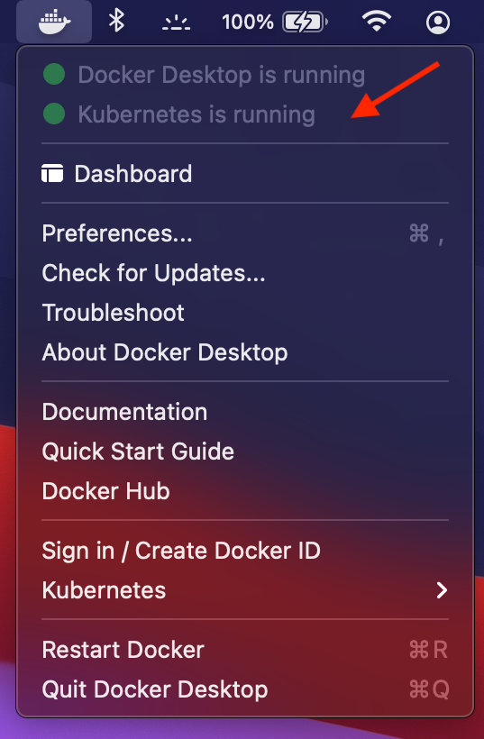

# Kubernetes - TP4 : Installation de Kubernetes
> **Objectifs du TP** :
>- Installer Kubernetes via Docker Desktop ou Minikube 

## Installation Kubernetes MacOS

Ces instructions concernent l'utilisation de Kubernetes intégré à Docker Desktop au lieu de Minikube sur macOS. 

Si Docker Desktop n'est pas pris en charge par votre système d'exploitation ou si vous souhaitez utiliser Minikube,
veuillez consulter les instructions d'installation et de configuration de Minikube en dessous

Remarque - Il est supposé que Docker Desktop a déjà été installé et fonctionne.

1 - Cliquez sur l'icône Docker située sur le côté droit de la barre de menus macOS.


2 - Cliquez sur Préférences dans le menu déroulant qui apparaît.


3 - Cliquez sur Kubernetes dans le menu de gauche.

4 - Cochez la case Activer Kubernetes, puis cliquez sur le bouton Appliquer et redémarrer.

5 - Cliquez sur Installer pour autoriser l'installation du cluster.

6 - Une fois la boîte de dialogue d'installation disparue, cliquez sur l'icône Docker pour vous assurer qu'un message Kubernetes est en cours d'exécution et un cercle vert.



7 - Ensuite, sélectionnez Kubernetes dans ce menu déroulant et assurez-vous que le contexte est défini sur docker-desktop et non sur quelque chose d'autre comme minikube ou kind.


8 - Enfin, ouvrez votre terminal et lancer la commande `kubectl version`

`````shell
$ kubectl version
Client Version: version.Info{Major:"1", Minor:"18", GitVersion:"v1.18.6", GitCommit:"dff82dc0de47299ab66c83c626e08b245ab19037", GitTreeState:"clean", BuildDate:"2020-07-15T16:58:53Z", GoVersion:"go1.13.9", Compiler:"gc", Platform:"darwin/amd64"}
Server Version: version.Info{Major:"1", Minor:"20", GitVersion:"v1.20.2", GitCommit:"faecb196815e248d3ecfb03c680a4507229c2a56", GitTreeState:"clean", BuildDate:"2021-01-13T13:20:00Z", GoVersion:"go1.15.5", Compiler:"gc", Platform:"linux/amd64"}
`````

Fin du TP 


## Installation Kubernetes Windows

Ces instructions concernent l'utilisation de Kubernetes intégré à Docker Desktop au lieu de Minikube sous Windows. 

Si vous ne souhaitez pas utiliser Docker Desktop, veuillez consulter les instructions d'installation et de configuration de Minikube en dessous.

Remarque - Il est supposé que Docker Desktop a déjà été installé et fonctionne.

1 - Cliquez sur la flèche orientée vers le haut sur le côté droit de la barre d'état système de Windows, puis cliquez sur l'icône Docker.


2 - Cliquez sur l'icône d'engrenage dans la barre de menu supérieure de l'application Docker Desktop.


3 - Dans la section Paramètres généraux, assurez-vous que la case Utiliser le moteur basé sur WSL 2 est cochée. Cela suppose que WSL2 est pris en charge 
par votre système d'exploitation et qu'il a déjà été installé et activé. Si ce n'est pas le cas, 
veuillez consulter les instructions de configuration de WSL2 [ici](https://docs.microsoft.com/en-us/windows/wsl/install).

4 - Cliquez sur Kubernetes dans le menu de gauche.

5 - Cochez la case Activer Kubernetes, puis cliquez sur le bouton Appliquer et redémarrer.

6 - Cliquez sur Installer pour autoriser l'installation du cluster.

7 - Une fois la boîte de dialogue d'installation disparue, regardez en bas à gauche de la page Paramètres généraux et assurez-vous 
qu'il y a une icône verte Kubernetes. Si vous cliquez dessus, une info-bulle RUNNING devrait s'afficher.


8 - Enfin, ouvrez votre terminal et lancer la commande `kubectl version`

Fin du TP

## Installation Minikube MacOS

Si vous utilisez déjà Kubernetes de Docker Desktop, vous n'avez pas besoin de Minikube et ces instructions peuvent être ignorées.

### Installer Minikube avec Homebrew

Tout d'abord, assurez-vous que Homebrew est installé. Sinon, suivez les instructions [ici](https://brew.sh/).


Ensuite, dans votre terminal, exécutez :

`````shell
$ brew install minikube
`````

### Installer Minikube sans Homebrew

Si vous ne souhaitez pas utiliser Homebrew, vous pouvez utiliser cURL pour télécharger les binaires.

Dans votre terminal, exécutez :

`````shell
$ curl -LO https://storage.googleapis.com/minikube/releases/latest/minikube-darwin-amd64
$ sudo install minikube-darwin-amd64 /usr/local/bin/minikube
`````

### Démarrer Minikube et tester l'installation

Après avoir installé avec succès Minikube, nous devons démarrer et tester le cluster pour nous assurer que tout fonctionne correctement.

1 - Démarrer la VM

Dans votre terminal, exécutez :

````shell
$ minikube start --driver=hyperkit
````


2 - Vérifier le statut de Minikube

Après avoir vu un Done!  dans votre terminal, exécutez `minikube status` pour vous assurer que le cluster est sain. 
Faites particulièrement attention à ce que l'apiserver soit dans un état "Running".


3 - Vérifier le statut de Kubectl

Enfin, ouvrez votre terminal et assurez-vous que vous pouvez exécuter la commande  `kubectl version`: 


Fin du TP

## Installation Minikube Windows

Ces instructions concernent la configuration et l'installation de Minikube sur Windows Pro si vous utilisez HyperV comme backend. 

Si vous utilisez WSL2, vous devez vous arrêter et revenir aux instructions pour activer Kubernetes de Docker Desktop à la place.

Si vous utilisez déjà Kubernetes de Docker Desktop, vous n'avez pas besoin de Minikube et ces instructions peuvent être ignorées.


### Installer Minikube 

1 - Téléchargez le programme d'installation de Windows [ici](https://storage.googleapis.com/minikube/releases/latest/minikube-installer.exe)

2 - Double-cliquez sur le fichier .exe qui a été téléchargé et exécutez le programme d'installation. Toutes les sélections par défaut sont appropriées.

### Démarrer Minikube avec HyperV

Après avoir installé avec succès Minikube, nous devons démarrer et tester le cluster pour nous assurer que tout fonctionne correctement.

1 - Démarrer la VM

Dans votre terminal, exécutez :

````shell
$ minikube start --driver=hyperv
````


2 - Vérifier le statut de Minikube

Après avoir vu un Done!  dans votre terminal, exécutez `minikube status` pour vous assurer que le cluster est sain.
Faites particulièrement attention à ce que l'apiserver soit dans un état "Running".


3 - Vérifier le statut de Kubectl

Enfin, ouvrez votre terminal et assurez-vous que vous pouvez exécuter la commande  `kubectl version`:


Fin du TP

## Installation Minikube Linux

Ces instructions doivent être valides pour les distributions Linux Debian, Ubuntu ou Mint. 
Votre expérience peut varier si vous utilisez d'autres distributions telles que RHEL, Arch, des distributions non de bureau comme le serveur 
Ubuntu ou des distributions légères qui peuvent omettre de nombreux outils attendus.

### Installer Minikube 

Dans votre terminal, exécutez ce qui suit :

`````shell
$ curl -LO https://storage.googleapis.com/minikube/releases/latest/minikube-linux-amd64
$ sudo install minikube-linux-amd64 /usr/local/bin/minikube
`````

### Démarrer Minikube et tester l'installation


Après avoir installé avec succès Minikube, nous devons démarrer et tester le cluster pour nous assurer que tout fonctionne correctement.

1- Ajouter votre utilisateur au groupe docker

Remarque - Si cette étape a été effectuée lors de l'installation de Docker, elle peut être ignorée.

Dans votre terminal, exécutez :

`````shell
$ sudo usermod -aG docker $USER && newgrp docker
`````

Déconnectez-vous du profil utilisateur et reconnectez-vous pour que ces modifications prennent effet. 
Si vous l'exécutez à l'intérieur d'une machine virtuelle, vous devrez redémarrer l'ensemble de la machine, pas seulement vous déconnecter.

2. Démarrez avec le driver par défaut :

Dans votre terminal, exécutez :

`````shell
$ minikube start
`````


2 - Vérifier le statut de Minikube

Après avoir vu un Done!  dans votre terminal, exécutez `minikube status` pour vous assurer que le cluster est sain.
Faites particulièrement attention à ce que l'apiserver soit dans un état "Running".


3 - Installer Kubectl

Dans votre terminal, exécutez ce qui suit :

`````shell
$ curl -LO "https://dl.k8s.io/release/$(curl -L -s https://dl.k8s.io/release/stable.txt)/bin/linux/amd64/kubectl"
$ sudo install -o root -g root -m 0755 kubectl /usr/local/bin/kubectl
`````

4 - Tester Kubectl

Enfin, ouvrez votre terminal et assurez-vous que vous pouvez exécuter la commande `kubectl version`: 


Fin du TP
