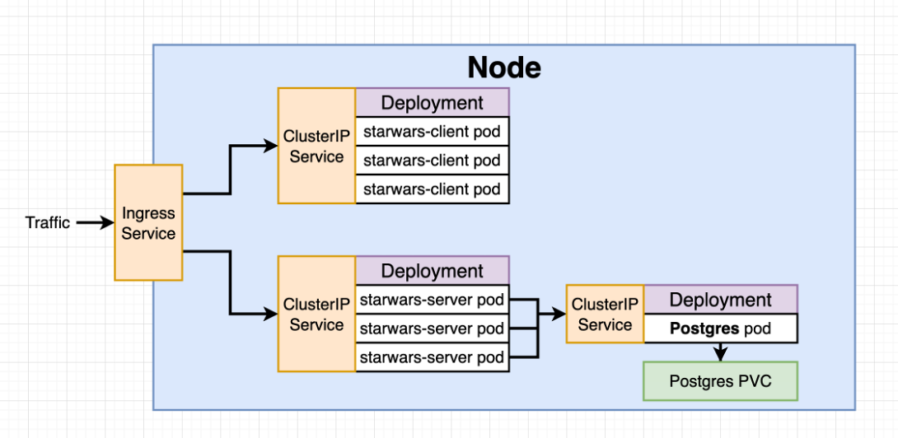

# Kubernetes - TP5 : Projet avec Kubernetes
> **Sommaire du TP** :
>- Cloner le repository
>- Créer le Dockerfile Front
>- Créer le Dockerfile Back
>- Créer le Docker Compose
>- Lancer le projet
>- Ajouter les variables d'environnement
>- Volumes de la base de données
>- Volumes des app back et front
>- Mise en place d'un workflow de production

## 1 - Cloner le repository

La première étape est de cloner le repo github contenant le projet.

Le repo est disponible sur [ce lien](https://github.com/elie91/Jedy-StarWarsKubernetes)

Il s'agit du projet que nous avions créé lors du TP sur Docker Compose : une application web composé d'une API Node et d'un front React,
avec une base de données Postgres, le tout fonctionnant avec Docker et Docker Compose

L'objectif de ce TP est de transformer ce projet en un cluster Kubernetes

Voici l'architecture du cluster que nous allons mettre en place : 

Le trafic réseau sera géré par un service Ingress, qui va envoyer la requête au back ou au front en fonction de l'url.

Le reste du cluster sera composé de : 
* Un `Deployment` contenant 3 pods du front de notre application
* Un `ClusterIp` pour exposer le Deployment front aux autres services
* Un `Deployment` contenant 3 pods du back de notre application
* Un `ClusterIp` pour exposer le back front aux autres services
* Un `Deployment` pour postgres contenant 1 pod 
* Un `ClusterIp` pour exposer postgres aux autres services
* Un `PVC` (Persistent Volume Claim) pour sauvegarder la donnée écrite par la base

## 2 - Création du Deployment Front

## 3 - Création du ClusterIP Front

## 4 - Création du Deployment Back

## 5 - Création du ClusterIP Back

## 6 - Création du Deployment Postgres

## 7 - Création du ClusterIP Postgres

## 8 - Création des Volumes

## 9 - Création des Secrets

## 10 - Installation d'Ingress

## 11 - Création de l'Ingress Controller

## 12 -Tester le cluster

